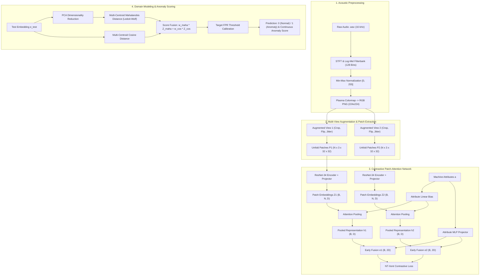

# Attribute-Conditioned Patch-Attention Contrastive Learning for Anomalous Sound Detection

[](https://www.python.org/)
[](https://pytorch.org/)
[](https://dcase.community/)
[](LICENSE)

An end-to-end, modular, production-ready framework for **Unsupervised Anomalous Sound Detection (ASD)** in machine condition monitoring under severe domain-shifted operating conditions (DCASE Task 2).

---

## 📑 Table of Contents

1. [Executive Summary & Motivation](#-executive-summary--motivation)
2. [System Architecture](#-system-architecture)
3. [Mathematical & Algorithmic Formulation](#-mathematical--algorithmic-formulation)
   - [1. Time-Frequency Acoustic Representation](#1-time-frequency-acoustic-representation)
   - [2. Multi-View Patch Unfolding & Backbone Encoding](#2-multi-view-patch-unfolding--backbone-encoding)
   - [3. Attribute-Conditioned Attention Pooling & Early Fusion](#3-attribute-conditioned-attention-pooling--early-fusion)
   - [4. Self-Supervised Contrastive Optimization (NT-Xent)](#4-self-supervised-contrastive-optimization-nt-xent)
   - [5. Multi-Centroid Normal Domain Modeling & Anomaly Scoring](#5-multi-centroid-normal-domain-modeling--anomaly-scoring)
4. [Project Directory Structure](#-project-directory-structure)
5. [Installation & Setup](#-installation--setup)
6. [Command-Line Interface (CLI) Guide](#-command-line-interface-cli-guide)
   - [Step 1: Audio Preprocessing](#step-1-audio-preprocessing)
   - [Step 2: Joint Contrastive Training](#step-2-joint-contrastive-training)
   - [Step 3: Checkpoint Evaluation](#step-3-checkpoint-evaluation)
   - [Step 4: Hyperparameter Grid Search & Tuning](#step-4-hyperparameter-grid-search--tuning)
7. [Evaluation Metrics & Benchmark Protocols](#-evaluation-metrics--benchmark-protocols)
8. [Configuration Reference](#-configuration-reference)

---

## 🌟 Executive Summary & Motivation

Machine condition monitoring via acoustic anomaly detection is challenging because:
- **No Anomaly Labels during Training**: Industrial systems operate almost exclusively in normal regimes. Models must be trained solely on normal acoustic recordings.
- **Domain Shift**: Variations in operational speed, load, environmental acoustics, or microphone positioning create distinct **Source Domains** and **Target Domains**.
- **Heterogeneous Machine Dynamics**: Distinct machine categories (`ToyCar`, `ToyTrain`, `bearing`, `valve`, `fan`, `gearbox`, `slider`) have fundamentally different acoustic signatures and metadata attributes.

This framework integrates:
1. **Multi-Scale Log-Mel RGB Spectrogram Transformation**: Converts raw sound waveforms into high-resolution 3-channel visual spectrograms.
2. **Local Patch Unfolding**: Captures fine-grained time-frequency acoustic textures using overlapping 2D patches.
3. **ResNet-34 Feature Backbone + Projector**: Deep representation learning over acoustic patches.
4. **Attribute-Conditioned Attention Pooling**: Learns patch-level importance weights dynamically modulated by operational machine metadata.
5. **Early Attribute Fusion**: Concatenates pooled representations with non-linearly projected attribute vectors.
6. **Multi-Machine Joint Contrastive Learning**: Optimizes discriminative representations via a numerically stabilized NT-Xent loss across all machine types simultaneously.
7. **Robust Multi-Centroid Normal Modeling**: Employs PCA dimensionality reduction, K-Means mode clustering, Ledoit-Wolf regularized covariance shrinkage for Mahalanobis scoring, and Cosine distance ensembles with target False-Positive-Rate (FPR) threshold calibration.

---

## 🏗 System Architecture



---

## 🔬 Mathematical & Algorithmic Formulation

### 1. Time-Frequency Acoustic Representation

For a discrete audio waveform $y(t)$ sampled at $f_s = 16\text{ kHz}$, the Short-Time Fourier Transform (STFT) is computed using a Hann window $w(n)$ of length $N_{\text{fft}} = 1024$ and hop length $H = 512$:

$$X(m, \omega) = \sum_{n=-\infty}^{\infty} y(n) w(n - mH) e^{-j \omega n}$$

The power spectrogram is mapped onto $M = 128$ Mel-frequency filterbanks $H_m(\omega)$ spanning $f_{\min} = 20\text{ Hz}$ to $f_{\max} = 8000\text{ Hz}$:

$$S_{\text{Mel}}(m, k) = \sum_{\omega} |X(m, \omega)|^2 H_k(\omega), \quad k \in [1, M]$$

Logarithmic compression converts power to decibels:

$$S_{\text{dB}}(m, k) = 10 \log_{10} \left( \frac{S_{\text{Mel}}(m, k)}{\max_{m', k'} S_{\text{Mel}}(m', k') + \epsilon} \right)$$

The resulting 2D matrix is linearly mapped to $[0, 255]$, colormapped via the `plasma` colormap, and resized to an RGB image $\mathbf{I} \in \mathbb{R}^{3 \times 224 \times 224}$.

---

### 2. Multi-View Patch Unfolding & Backbone Encoding

Given a spectrogram $\mathbf{I}$, two stochastic augmentations $\tilde{\mathbf{I}}^{(1)}, \tilde{\mathbf{I}}^{(2)} \sim \mathcal{T}$ (Random Resized Crop, Color Jitter, Horizontal Flip, Grayscale) are generated.

An unfolding operator $\mathcal{U}$ extracts overlapping $32 \times 32$ spatial patches with stride $S = 16$:

$$\mathbf{P} = \mathcal{U}(\tilde{\mathbf{I}}) \in \mathbb{R}^{N \times 3 \times 32 \times 32}$$

Each patch $\mathbf{p}_i$ is passed through a ResNet-34 backbone $f_\theta$ (yielding 512-dim features) followed by a 2-layer MLP projection head $g_\phi$:

$$\mathbf{z}_i = g_\phi(f_\theta(\mathbf{p}_i)) \in \mathbb{R}^{D}, \quad D = 128$$

---

### 3. Attribute-Conditioned Attention Pooling & Early Fusion

To aggregate $N$ patch embeddings into a single vector, an attention mechanism computes patch saliency weights conditioned on machine operational attributes $\mathbf{a} \in \mathbb{R}^{d_{\text{attr}}}$:

$$s_i = \mathbf{w}_2^T \tanh(\mathbf{W}_1 \mathbf{z}_i + \mathbf{b}_1)$$

$$\tilde{s}_i = s_i + \mathbf{w}_{\text{attr}}^T \mathbf{a}$$

$$\alpha_i = \frac{\exp(\tilde{s}_i)}{\sum_{j=1}^N \exp(\tilde{s}_j)}$$

The pooled acoustic representation is:

$$\mathbf{h} = \sum_{i=1}^N \alpha_i \mathbf{z}_i \in \mathbb{R}^{D}$$

When operational attributes are available, an attribute MLP maps $\mathbf{a} \to \mathbb{R}^D$ and performs early concatenation fusion:

$$\mathbf{e} = [\mathbf{h} \;\|\; \text{MLP}_{\text{attr}}(\mathbf{a})] \in \mathbb{R}^{2D}$$

---

### 4. Self-Supervised Contrastive Optimization (NT-Xent)

Given a minibatch of $B$ samples producing $2B$ views $\{\mathbf{e}_1, \dots, \mathbf{e}_{2B}\}$, the representations are normalized to unit hypersphere $\hat{\mathbf{e}}_i = \frac{\mathbf{e}_i}{\|\mathbf{e}_i\|_2}$. The NT-Xent loss with temperature $\tau = 0.1$ is defined as:

$$\mathcal{L}_{i, j} = -\log \frac{\exp(\hat{\mathbf{e}}_i \cdot \hat{\mathbf{e}}_j / \tau)}{\sum_{k=1, k \neq i}^{2B} \exp(\hat{\mathbf{e}}_i \cdot \hat{\mathbf{e}}_k / \tau)}$$

We implement this via `torch.logsumexp` to eliminate potential numerical overflow/underflow during large-batch gradient backpropagation.

---

### 5. Multi-Centroid Normal Domain Modeling & Anomaly Scoring

During inference, models are evaluated under severe domain shift. For each machine type and domain (Source and Target), normal training embeddings $\mathbf{Z}_{\text{train}}$ are modeled:

1. **Dimensionality Reduction**: Principal Component Analysis (PCA) retains $98\%$ of variance: $\mathbf{X} = \text{PCA}(\mathbf{Z}_{\text{train}}) \in \mathbb{R}^{M \times d_{\text{sub}}}$.
2. **Multi-Centroid Clustering**: $K$-Means clustering ($K \in [3, 8]$) partitions normal representations into operating modes $\{\mathcal{C}_1, \dots, \mathcal{C}_K\}$ with centers $\boldsymbol{\mu}_k$.
3. **Regularized Covariance Estimation**: Ledoit-Wolf shrinkage estimates per-cluster precision matrices $\mathbf{\Sigma}_k^{-1}$:
   $$\mathbf{\Sigma}_{\text{LW}} = (1 - \beta) \mathbf{\Sigma}_{\text{Emp}} + \beta \nu \mathbf{I}$$
4. **Squared Mahalanobis Distance**:
   $$d_{\text{Maha}}^2(\mathbf{x}) = \min_{k \in \{1,\dots,K\}} (\mathbf{x} - \boldsymbol{\mu}_k)^T \mathbf{\Sigma}_k^{-1} (\mathbf{x} - \boldsymbol{\mu}_k)$$
5. **Cosine Distance to Centroids**:
   $$d_{\text{Cos}}(\mathbf{z}) = \min_{k \in \{1,\dots,K\}} \left(1 - \frac{\mathbf{z} \cdot \mathbf{c}_k}{\|\mathbf{z}\|_2 \|\mathbf{c}_k\|_2}\right)$$
6. **Score Standardization & Fusion**:
   $$\mathcal{A}(\mathbf{z}) = w_{\text{maha}} \left(\frac{d_{\text{Maha}}^2 - \mu_{\text{maha}}}{\sigma_{\text{maha}}}\right) + w_{\text{cos}} \left(\frac{d_{\text{Cos}} - \mu_{\text{cos}}}{\sigma_{\text{cos}}}\right)$$
7. **Decision Threshold Calibration**: Calibrated from normal training distribution scores $\mathcal{A}_{\text{train}}$ given a target False-Positive Rate $\alpha = 0.05$:
   $$\theta_{\text{FPR}} = \text{Quantile}_{1 - \alpha}(\mathcal{A}_{\text{train}})$$
   $$\hat{y} = \begin{cases} 1 & \text{if } \mathcal{A}(\mathbf{z}) \ge \theta_{\text{FPR}} \quad (\text{Anomaly}) \\ 0 & \text{otherwise} \quad (\text{Normal}) \end{cases}$$

---

## 📁 Project Directory Structure

```
Anomaly Sound Detection/
├── cli.py                        # Unified command-line interface entry point
├── requirements.txt              # Production dependency specifications
├── pyproject.toml                # Build system & package metadata
├── .gitignore                    # Git tracking rules
├── README.md                     # Comprehensive architectural documentation
├── src/                          # Core source code package
│   ├── __init__.py               # Package root
│   ├── config.py                 # Strongly typed dataclass configurations
│   ├── data/                     # Data processing & datasets
│   │   ├── __init__.py
│   │   ├── audio_processing.py   # Parallel .wav to Log-Mel RGB converter
│   │   ├── attributes.py         # Machine attribute parsing & global alignment
│   │   └── dataset.py            # Patch unfolding dataset & deterministic eval dataset
│   ├── models/                   # Neural network architectures
│   │   ├── __init__.py
│   │   ├── backbone.py           # ResNet-18/34/50 vision feature encoders
│   │   ├── attention.py          # Attribute-Conditioned Attention Pooling
│   │   ├── patch_model.py        # PatchAttentionCLModel (End-to-End)
│   │   └── losses.py             # Numerically stable NT-Xent contrastive loss
│   ├── evaluation/               # Domain modeling & evaluation
│   │   ├── __init__.py
│   │   ├── domain_model.py       # Multi-centroid scoring engine (PCA, K-Means, Ledoit-Wolf)
│   │   ├── metrics.py            # ROC-AUC, pAUC (max_fpr=0.1), F1, Harmonic Means
│   │   └── evaluator.py          # Domain evaluation runner
│   ├── pipelines/                # High-level executable workflows
│   │   ├── __init__.py
│   │   ├── preprocess.py         # Batch spectrogram generation pipeline
│   │   ├── train.py              # Joint contrastive multi-machine training
│   │   ├── evaluate.py           # Checkpoint evaluation across machines & domains
│   │   └── tune.py               # Hyperparameter grid search for domain scoring
│   └── utils/                    # Shared helper utilities
│       ├── __init__.py
│       ├── common.py             # Seed initialization, device resolution, logging
│       └── checkpoint.py         # Checkpoint manager with rolling retention
└── tests/                        # Unit test suite
    ├── __init__.py
    ├── test_config.py            # Configuration & serialization tests
    ├── test_domain_model.py      # Covariance, Mahalanobis & Cosine tests
    └── test_metrics.py           # AUC, pAUC, classification metrics tests
```

---

## ⚙️ Installation & Setup

### Prerequisites
- Python $\ge 3.8$
- CUDA-compatible GPU (recommended for training)

### 1. Clone the Repository
```bash
git clone https://github.com/your-username/anomaly-sound-detection.git
cd "anomaly-sound-detection"
```

### 2. Create and Activate Virtual Environment
```bash
python3 -m venv venv
source venv/bin/activate  # On Windows: venv\Scripts\activate
```

### 3. Install Dependencies
```bash
pip install --upgrade pip
pip install -r requirements.txt
```

---

## 🚀 Command-Line Interface (CLI) Guide

All project workflows can be run seamlessly using `cli.py`:

```bash
python cli.py --help
```

### Step 1: Audio Preprocessing
Convert raw `.wav` audio files into $224 \times 224$ Log-Mel RGB spectrogram PNGs using parallel processing:

```bash
python cli.py preprocess \
  --base-dir training_data \
  --sample-rate 16000 \
  --n-mels 128 \
  --num-workers 4 \
  --cmap plasma
```

### Step 2: Joint Contrastive Training
Train the `PatchAttentionCLModel` jointly across all machine types:

```bash
python cli.py train \
  --root-dir training_data \
  --checkpoint-dir checkpoints \
  --batch-size 32 \
  --epochs 100 \
  --lr 2e-4 \
  --temperature 0.1 \
  --embed-dim 128 \
  --max-patches 64 \
  --stride 16 \
  --num-workers 4 \
  --device auto
```

### Step 3: Checkpoint Evaluation
Evaluate a trained model checkpoint across all machine types for both Source and Target domains:

```bash
python cli.py evaluate \
  --checkpoint checkpoints/epoch100.pth \
  --root-dir training_data \
  --batch-size 64 \
  --k-clusters 5 \
  --cov-type lw \
  --target-fpr 0.05
```

### Step 4: Hyperparameter Grid Search & Tuning
Tune domain modeling hyperparameters ($K$, covariance types, PCA variance, Mahalanobis vs. Cosine weighting) directly in embedding space without retraining:

```bash
python cli.py tune \
  --checkpoint checkpoints/epoch100.pth \
  --root-dir training_data \
  --top-n 5
```

---

## 📊 Evaluation Metrics & Benchmark Protocols

According to the official **DCASE Task 2** benchmark rules, models are evaluated using:

1. **Area Under ROC Curve (AUC)**:
   $$\text{AUC} = \frac{1}{N_- N_+} \sum_{i=1}^{N_-} \sum_{j=1}^{N_+} \mathcal{H}(\mathcal{A}(\mathbf{x}_j^+) - \mathcal{A}(\mathbf{x}_i^-))$$
2. **Partial AUC ($p\text{AUC}$ with $\text{max\_fpr} = 0.1$)**:
   Computes the Area Under the ROC curve strictly within the low false-positive range $[0, 0.1]$:
   $$p\text{AUC} = \frac{1}{0.1} \int_{0}^{0.1} \text{TPR}(\text{FPR}) \, d\text{FPR}$$
3. **Harmonic Mean**:
   Aggregates domain-specific metrics across all machine types penalizing poor outliers:
   $$\bar{M}_{\text{harmonic}} = \frac{K}{\sum_{k=1}^K \frac{1}{M_k}}$$

---

## 📋 Configuration Reference

All configurations are modularly defined in `src/config.py`:

| Config Class | Key Parameters | Default Value | Description |
| :--- | :--- | :--- | :--- |
| `AudioConfig` | `sample_rate`<br>`n_fft`<br>`hop_length`<br>`n_mels`<br>`cmap_name` | `16000`<br>`1024`<br>`512`<br>`128`<br>`"plasma"` | Audio waveform loading & Log-Mel spectrogram generation |
| `DatasetConfig` | `patch_size`<br>`stride`<br>`max_patches`<br>`machine_types` | `32`<br>`16`<br>`64`<br>`ALL_DEFAULT` | Spatial patch unfolding & dataset partitioning |
| `ModelConfig` | `backbone`<br>`embed_dim`<br>`attn_hidden_dim` | `"resnet34"`<br>`128`<br>`128` | Deep visual backbone & attention network dimensions |
| `TrainConfig` | `batch_size`<br>`epochs`<br>`learning_rate`<br>`temperature` | `32`<br>`100`<br>`2e-4`<br>`0.1` | Joint optimization hyperparameters |
| `DomainModelConfig` | `k`<br>`cov_type`<br>`use_pca`<br>`pca_variance`<br>`w_maha`<br>`w_cos`<br>`target_fpr` | `5`<br>`"lw"`<br>`True`<br>`0.98`<br>`0.7`<br>`0.3`<br>`0.05` | Multi-centroid normal distribution modeling & score fusion |

---

## 📜 License

This project is licensed under the MIT License - see the [LICENSE](LICENSE) file for details.
